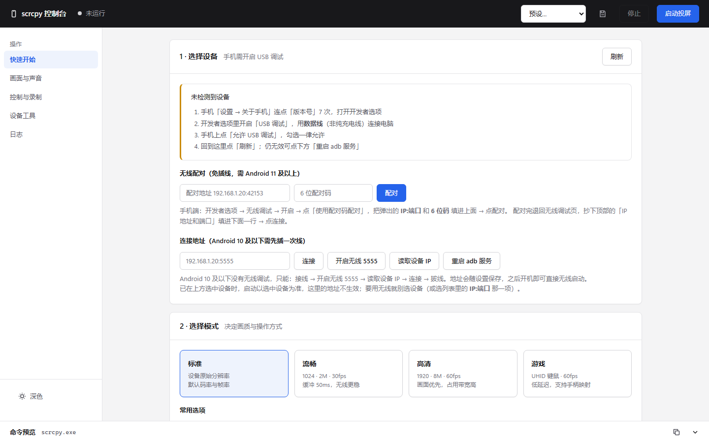

# scrcpy 控制台（scrcpy Console）

**为 [scrcpy](https://github.com/Genymobile/scrcpy) 打造的 Windows 桌面图形控制台** —— 免命令行、免浏览器、免安装依赖，双击即用。

<p align="center">
  
</p>

> scrcpy 是由 Genymobile 开源的 Android 投屏与控制工具（Apache-2.0），
> 本项目是它的图形化封装：核心的采集、编码、控制能力全部由 scrcpy 提供，
> 本项目只负责把「记参数、敲命令」变成「点鼠标」。

## 这是什么

scrcpy 本身是纯命令行工具，参数有几十个。本项目提供：

| 能力 | 说明 |
|---|---|
| 桌面应用 | 原生窗口（WebView2），不开浏览器、无黑窗口，关窗即退出 |
| 可视化设置 | 视频/音频/窗口/控制/录制/摄像头 全参数图形化，实时生成命令预览 |
| 模式预设 | 标准 / 流畅 / 高清 / 游戏 一键套用，自定义预设可保存 |
| 无线投屏 | 支持 Android 11+ 免插线配对（无线调试配对码），10 及以下走 tcpip 5555 |
| 设备工具 | 物理按键、截屏到电脑、拖放安装 APK、发文本/开网址/启动应用、执行 shell |
| 录屏 | 一键录制 mkv/mp4，自动时间戳命名 |
| 明暗主题 | 跟随切换，设置自动持久化 |

## 下载使用

到 [Releases](../../releases) 下载 `scrcpy-console.exe`（约 33 MB，内置 scrcpy 4.1 + adb），双击即可。

**系统要求**

- Windows 10 / 11 x64
- WebView2 运行时（系统自带；没有会自动降级为 Edge 独立窗口）
- Android 5.0+ 的手机，投屏控制需开启 USB 调试；音频转发需 Android 11+

> exe 未做代码签名，首次运行被 SmartScreen 拦截时点「更多信息 → 仍要运行」。

**三步上手**

1. **选设备** —— 手机开 USB 调试并接线（或用页面上的无线配对），点「刷新」选中设备
2. **选模式** —— 标准 / 流畅 / 高清 / 游戏，按需微调参数
3. **启动** —— 点「启动投屏」，停止时关掉投屏窗口或点「停止」

无线投屏（Android 11+，全程免插线）：手机开「无线调试」→「使用配对码配对」，
把弹出的 `IP:端口` 与 6 位码填入控制台「无线配对」完成配对，再连接无线调试页顶部的地址。
手机与电脑须在同一局域网。

**投屏窗口快捷键**（MOD = 左 Alt 或左 Win）：

`MOD+F` 全屏 · `MOD+B`/右键 返回 · `MOD+H`/中键 主屏 · `MOD+S` 最近任务 ·
`MOD+O` 熄屏继续投 · `MOD+V` 粘贴电脑剪贴板 · `MOD+R` 旋转画面

## 从源码构建

```bash
pip install pyinstaller pywebview
python tools/build_scrcpy_app.py                # 自动下载官方 scrcpy 并打包
python tools/build_scrcpy_app.py --scrcpy-dir D:\path\to\scrcpy-win64-v4.1   # 用本地 scrcpy
```

产出单个 `scrcpy控制台.exe`。图标可由 `tools/make_scrcpy_icon.py` 重新生成（纯标准库，无 PIL 依赖）。

不想打包也可以直接跑源码：

```bash
pip install pywebview
python src/app.py        # 把 scrcpy 官方包解压到 src/ 的上一级目录，或放任意位置后改 server.py 顶部的查找路径
```

## 项目结构

```
src/app.py                 桌面外壳：内嵌本地 HTTP 服务 + WebView2 原生窗口
src/server.py              本地后端：adb 通信、scrcpy 参数拼装、进程管理（纯标准库，零 pip 依赖）
src/ui.html                前端界面：设置面板 / 命令预览 / 快捷工具 / 日志（单文件，无外部依赖）
src/app.ico                应用图标
tools/build_scrcpy_app.py  一键打包脚本
tools/make_scrcpy_icon.py  图标生成脚本
```

## 安全与隐私

- 控制台只监听 `127.0.0.1`，不对局域网/外网开放，不上传任何数据
- 运行产生的 `settings.json`、`logs/`、`screenshots/`（可能含设备序列号与内网 IP）均已列入 `.gitignore`

## 致谢与许可

- **[Genymobile/scrcpy](https://github.com/Genymobile/scrcpy)** —— 本项目的根基，Apache-2.0，版权归 Genymobile 与 Romain Vimont 所有。本仓库打包产物内含 scrcpy 官方二进制，分发时保留其许可证文本
- [pywebview](https://github.com/r0x0r/pywebview)（BSD-3-Clause）—— 桌面窗口能力
- 本项目自身代码同样以 **Apache-2.0** 发布，第三方组件明细见 [THIRD-PARTY-NOTICES.md](THIRD-PARTY-NOTICES.md)

---

*English*: A native Windows desktop GUI console for [scrcpy](https://github.com/Genymobile/scrcpy) — visual settings, wireless pairing, device tools and screen recording, packaged as a single portable exe with scrcpy and adb bundled. No browser, no Python required. Licensed under Apache-2.0; scrcpy remains the core and belongs to Genymobile.
